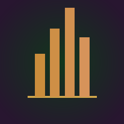
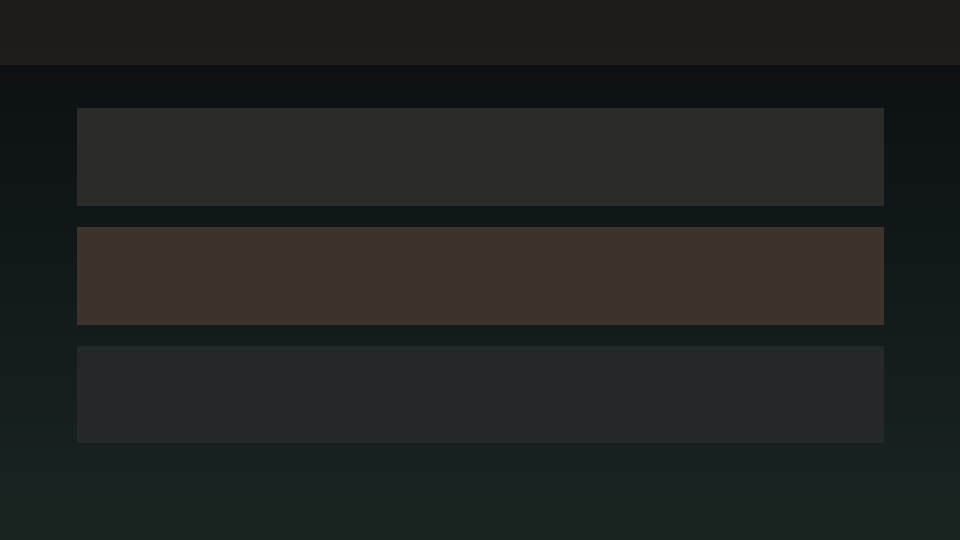
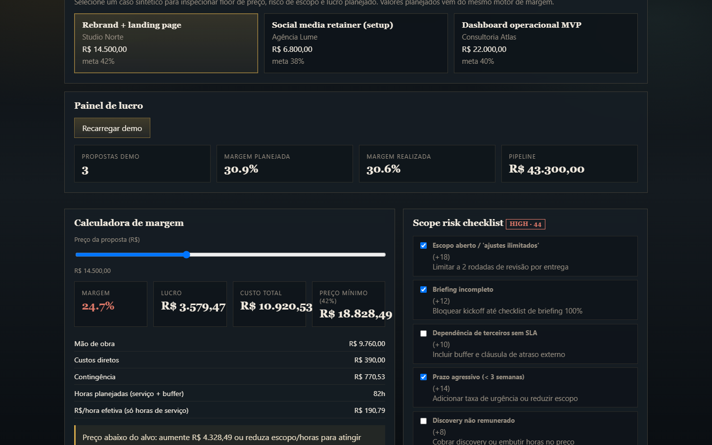
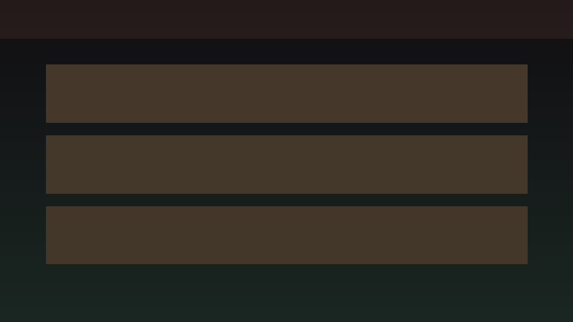
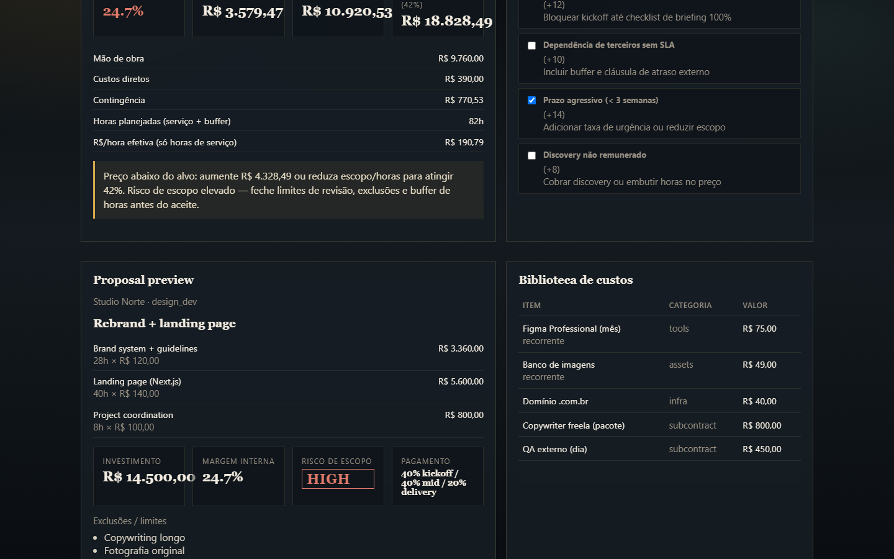
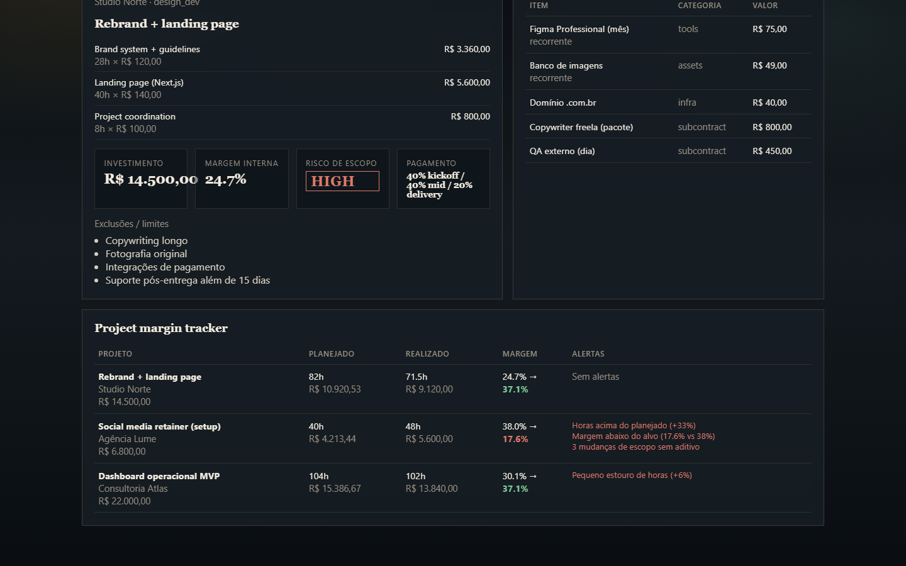
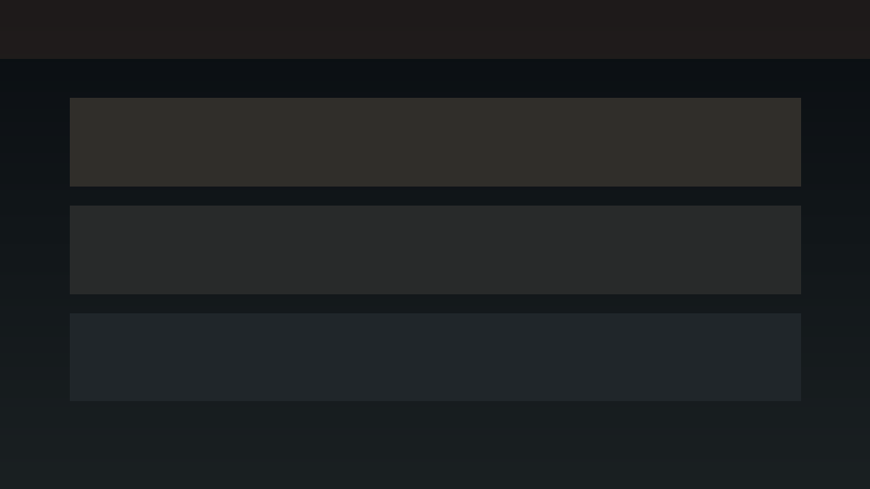
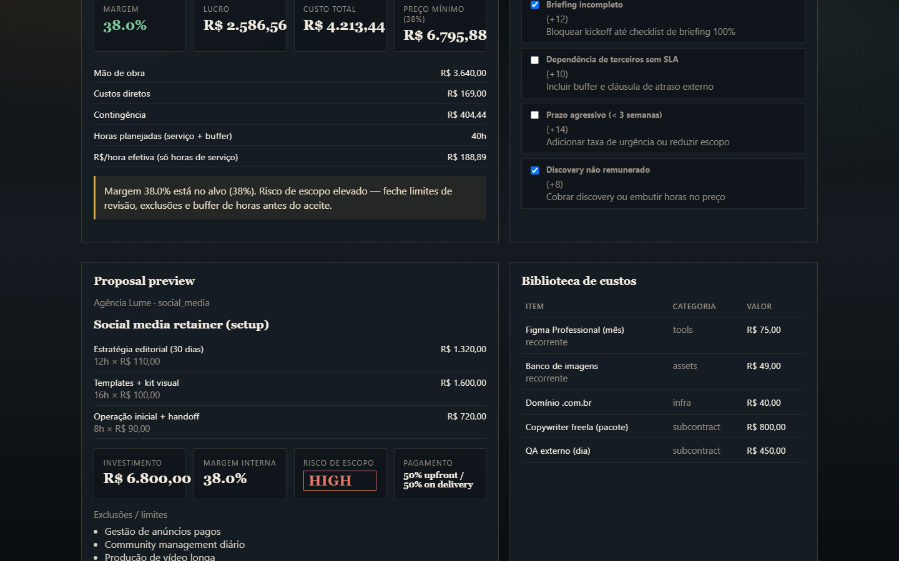
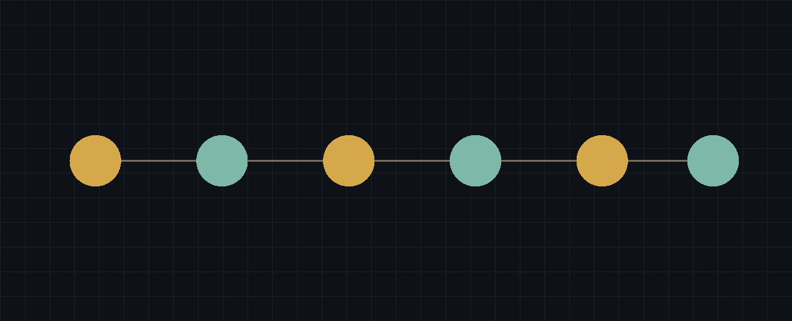

<div align="center">
  

  <h1>MarginDesk</h1>

  <p><strong>Transforma proposta em decisão de margem: preço mínimo, risco de escopo e lucro por projeto.</strong></p>
  <p><strong>Turn service proposals into margin decisions: price floor, scope risk and project profit tracking.</strong></p>

  <p>
    <a href="#1-visão-geral--overview">PT-BR / English Overview</a> •
    <a href="#-product-preview">Preview</a> •
    <a href="#-screenshots">Screenshots</a> •
    <a href="#️-stack--tecnologias">Stack</a> •
    <a href="#-arquitetura--architecture">Architecture</a> •
    <a href="#-quick-start--início-rápido">Quick Start</a> •
    <a href="#-autor--author">Author</a>
  </p>

  <p>
    
    
    
    
    
    
  </p>
</div>

<p align="center">
  
</p>

---

## 1. Visão Geral / Overview

O **MarginDesk** é um SaaS para prestadores de serviço que fazem propostas sem saber margem real, escopo vendido, horas previstas e lucro por projeto.

Ele organiza **briefing, custos, horas, preço, riscos de escopo e acompanhamento de margem**. Em vez de gerar apenas um PDF bonito, o núcleo do produto é rentabilidade: preço mínimo, margem esperada, checklist de risco e planejado vs realizado.

O projeto foi desenvolvido por **Felipe Alirio Baruja** como peça de portfólio de produto SaaS vendável — modelagem de regra de negócio, UX de precificação e billing-ready architecture.

> **Margin-First Notice**  
> O MarginDesk foi criado para proteger lucro de projetos de serviço. Ele **não substitui** ERP, CRM completo, gestão de tarefas nem contabilidade fiscal. O posicionamento é margem e proteção de lucro, não estética de proposta.

---

## ✨ Product Preview

<p align="center">
  
</p>

O MarginDesk apresenta uma experiência editorial de estúdio financeiro para serviços: cards de margem, sliders de preço/horas, alertas de risco de escopo e tracker de lucro por projeto.

---

## 2. Por que este projeto importa? / Why this project matters

* **Propostas no feeling destroem lucro:** Muitos freelancers e agências subestimam horas, esquecem custos e aceitam escopo aberto.
* **PDF bonito não paga a conta:** Geradores de proposta focam em layout; o MarginDesk foca em preço mínimo e margem.
* **Escopo é risco financeiro:** Checklist ponderado transforma “ajustes ilimitados” em score acionável antes do aceite.
* **Retenção pela operação:** Acompanhar planejado vs realizado cria hábito recorrente a cada nova proposta.

---

## 🧠 O diferencial do MarginDesk / What makes MarginDesk different

### Português
O MarginDesk não é um gerador de proposta. Ele combina calculadora de margem, builder guiado, risco de escopo e tracker de rentabilidade.

Ele mostra não apenas o preço enviado ao cliente, mas também:
- qual o preço mínimo para a margem-alvo;
- quanto custa a mão de obra, custos diretos e contingência;
- quais flags de escopo estão elevando o risco;
- como o realizado compara com o planejado;
- quais projetos estão comendo capacidade com margem ruim.

### English
MarginDesk is not a proposal PDF generator. It combines a margin calculator, guided builder, scope-risk checklist and profitability tracker.

It shows not only the price sent to the client, but also:
- the minimum price for the target margin;
- labor, direct costs and contingency;
- which scope flags raise delivery risk;
- how actuals compare to plan;
- which projects burn capacity with weak margin.

---

## 🎯 Problema que resolve / The problem it solves

Em fluxos reais de prestação de serviço, propostas costumam nascer com:
- horas subestimadas;
- custos esquecidos (ferramentas, freelas, licenças);
- escopo aberto sem limites de revisão;
- preço definido por “feeling” ou pelo orçamento do cliente;
- zero histórico de margem por projeto;
- prejuízo percebido só no final da entrega.

O **MarginDesk** cria uma camada de decisão entre o briefing e o aceite: preço, risco e lucro visíveis antes de comprometer capacidade.

---

## 🧩 Proposta / Margin Decision Pipeline

O MarginDesk processa uma proposta de serviço e entrega uma visão estruturada de custo, preço, risco e acompanhamento:

```txt
Briefing / serviços / custos
  ↓
Taxa/hora + horas planejadas
  ↓
Custos diretos + contingência
  ↓
Cálculo de margem e preço mínimo
  ↓
Scope risk checklist (score ponderado)
  ↓
Proposal preview + limites/exclusões
  ↓
Aceite simples
  ↓
Tracker planejado vs realizado
  ↓
Relatório de rentabilidade por projeto
```

---

## 📸 Screenshots

<table>
  <tr>
    <td width="50%">
      
      <br />
      <sub><strong>Margin Calculator</strong> — preço, custo, lucro, margem % e preço mínimo para a meta.</sub>
    </td>
    <td width="50%">
      
      <br />
      <sub><strong>Proposal Builder</strong> — serviços, horas, taxas e preview orientado a margem.</sub>
    </td>
  </tr>
  <tr>
    <td width="50%">
      
      <br />
      <sub><strong>Scope Risk Checklist</strong> — flags ponderados, mitigações e nível de risco.</sub>
    </td>
    <td width="50%">
      
      <br />
      <sub><strong>Cost Library</strong> — biblioteca de custos recorrentes e pontuais reutilizáveis.</sub>
    </td>
  </tr>
  <tr>
    <td width="50%">
      
      <br />
      <sub><strong>Project Margin Tracker</strong> — planejado vs realizado com alertas de estouro.</sub>
    </td>
    <td width="50%">
      
      <br />
      <sub><strong>Profit Panel</strong> — pipeline, margem média e projetos em risco.</sub>
    </td>
  </tr>
</table>

---

## 📄 Public Proposal & Billing

<p align="center">
  
</p>

A visão pública da proposta (fase 2) e o billing (Stripe/Mercado Pago) fecham o ciclo comercial sem transformar o produto em ERP.

---

## 📌 Estudo de Caso / Case Study

### 📌 Estudo de Caso: Rebrand + Landing (Studio Norte)
A demo simula uma proposta de R$ 14.500 com 76h de serviço + 6h de contingência, custos diretos de R$ 390 e meta de margem de 42%. O motor calcula mão de obra, contingência, margem efetiva, preço mínimo para a meta e score de risco com flags como escopo aberto, briefing incompleto e prazo agressivo.

O tracker compara três projetos ativos e destaca um caso com estouro de horas (+33%) e margem realizada caindo de ~38% para ~18% — exatamente a dor que o produto existe para evitar.

### 📌 Case Study: Rebrand + Landing (Studio Norte)
The demo simulates a R$14,500 proposal with 76 service hours + 6 contingency hours, R$390 direct costs and a 42% margin target. The engine computes labor, contingency, effective margin, minimum price for target and a risk score from flags such as open scope, incomplete brief and aggressive deadline.

The tracker compares three active projects and highlights one with hour overrun (+33%) and actual margin dropping from ~38% to ~18% — the exact pain the product is built to prevent.

---

## 🧭 Visual Story / Jornada do Prestador

A experiência do MarginDesk foi pensada como uma jornada de precificação responsável:
```txt
1. Carregar demo ou cadastrar serviços e custos
2. Definir taxa/hora, horas e contingência
3. Ajustar preço no slider e ver margem + preço mínimo
4. Marcar riscos de escopo e revisar mitigações
5. Conferir preview da proposta com exclusões
6. Enviar / registrar aceite simples
7. Acompanhar horas e custos no margin tracker
8. Agir em alertas de estouro antes do prejuízo consolidar
```

---

## ⚙️ Funcionalidades Principais / Core Features

### Margin Calculator
Breakdown de mão de obra, custos diretos, contingência, lucro, margem %, R$/hora efetiva e preço mínimo para a margem-alvo.

### Proposal Builder
Montagem guiada de proposta com serviços, horas, taxas, termos de pagamento e exclusões — sempre acoplada ao cálculo de margem.

### Scope Risk Checklist
Flags ponderados (escopo aberto, briefing incompleto, rush, terceiros, discovery não pago) com score e nível low/medium/high/critical.

### Cost Library
Biblioteca reutilizável de custos de ferramentas, assets, infra e subcontratação.

### Project Margin Tracker
Comparativo planejado vs realizado com alertas de horas, margem e mudanças de escopo sem aditivo.

### Profit Panel
Visão executiva de projetos ativos, margem média planejada/realizada, pipeline e projetos em risco.

---

## 🛠️ Stack / Tecnologias

### Frontend
- **Framework:** Next.js 15 (App Router) & React 19
- **Linguagem:** TypeScript
- **UI:** CSS editorial (estúdio financeiro)
- **Ícones:** Lucide Icons
- **Charts (roadmap):** Recharts

### Backend
- **Framework API:** FastAPI & Uvicorn (Python 3.12)
- **Modelagem & Validação:** Pydantic v2
- **Engine de margem:** TypeScript-ready rules espelhadas em Python testado
- **Suite de Testes:** Pytest

### Infra prevista
- Supabase (auth/dados), Stripe/Mercado Pago (billing), Resend (e-mail), PostHog, Sentry
- PDF/HTML proposal renderer (fase 2)

---

## 🧱 Arquitetura / Architecture

O projeto adota uma arquitetura monorepo simplificada:

```text
MarginDesk/
├── apps/
│   ├── web/                         # Frontend Next.js (App Router)
│   │   ├── app/                     # Página principal do desk
│   │   ├── components/              # Calculator, risk, tracker, preview
│   │   ├── lib/                     # API client
│   │   └── types/                   # Tipos TypeScript
│   │
│   └── api/                         # Backend FastAPI
│       ├── app/
│       │   ├── api/                 # /demo, /margin, /proposals, /tracker
│       │   ├── models/              # Schemas Pydantic
│       │   └── services/            # margin_engine, demo_data
│       └── tests/                   # Pytest (margem e endpoints)
│
├── data/
│   └── seed/                        # CSVs demo (serviços, custos, projetos)
│
├── docs/                            # Pitch e metodologia
├── assets/                          # Ícone, hero, screenshots
├── scripts/                         # Geração de assets/seed
├── start.bat                        # Inicializador Windows
└── README.md                        # Esta documentação
```

---

## 🧱 Visual Architecture

<p align="center">
  
</p>

MarginDesk follows a margin-first flow: services and costs enter the desk, get priced with contingency and target margin, scored for scope risk, previewed as a proposal and tracked as planned vs actual profit.

---

## 🔁 Margin Decision Flow

```txt
Services + Hourly Rates
  ↓
Direct Costs + Contingency Hours
  ↓
Total Cost Basis
  ↓
Price Slider / Target Margin
  ↓
Min Price + Expected Margin
  ↓
Scope Risk Flags → Risk Score
  ↓
Proposal Preview (exclusions / terms)
  ↓
Accept → Delivery Tracker
  ↓
Planned vs Actual Profit Report
```

---

## 🚀 Quick Start / Início Rápido

### Pré-requisitos
- **Node.js** v20 ou superior.
- **Python** v3.10 ou superior (preferencialmente Python 3.12).
- **Git**

### Live Demo
Demo pública (frontend-first, motor de margem no browser):

```txt
https://margindesk.vercel.app
```

*(URL final confirmada após o deploy Vercel; se o slug mudar, a homepage do GitHub e o portfólio apontam para a URL canônica.)*

### Opção 1 — Execução integrada no Windows
Na pasta raiz do projeto, dê dois cliques ou execute no console:
```bash
start.bat
```
Este script inicializa automaticamente o ambiente virtual Python (`.venv`), instala as dependências, inicia o backend FastAPI na porta `8000`, o frontend Next.js na porta `3000` e abre a aplicação no navegador padrão.

### Opção 2 — Execução manual

#### 1. Backend FastAPI (`apps/api`)
```bash
cd apps/api
python -m venv .venv
.venv\Scripts\activate            # Windows
source .venv/bin/activate          # Linux/macOS
pip install -r requirements.txt
uvicorn app.main:app --reload --port 8000
```
*API ativa em [http://127.0.0.1:8000](http://127.0.0.1:8000). Docs interativos em `/docs`.*

#### 2. Frontend Next.js (`apps/web`)
```bash
cd apps/web
npm install
npm run dev
```
*Frontend ativo em [http://localhost:3000](http://localhost:3000).*

---

## 🧪 Scripts e Testes / Scripts and Testing

### Rodar Testes de Backend (FastAPI/Pytest)
```bash
cd apps/api
.venv\Scripts\python -m pytest
```

### Validações de Frontend (Next.js)
```bash
cd apps/web
npm run lint         # Verificação de lint
npm run typecheck    # Verificação estrita de TypeScript
npm run build        # Compilação de produção
```

### Regenerar assets e seed
```bash
python scripts/generate_assets_and_seed.py
```

---

## 📊 Metodologia de Margem / Margin Methodology

O MarginDesk usa um modelo explícito e testável:
* **Custo de mão de obra:** Σ (horas × taxa/hora) por linha de serviço.
* **Contingência:** horas-buffer × taxa média ponderada.
* **Custos diretos:** soma da biblioteca/itens da proposta.
* **Margem %:** (Preço − Custo total) / Preço × 100.
* **Preço mínimo:** Custo total / (1 − meta%/100).
* **Risco de escopo:** soma dos pesos dos flags marcados → low/medium/high/critical.

Detalhes em [docs/technical_methodology.md](./docs/technical_methodology.md).

---

## 🛡️ Segurança e Boas Práticas

* **Sem segredos no repo:** `.env` ignorado; apenas `.env.example` versionado.
* **Validação Pydantic:** payloads de proposta validados na API.
* **Testes de margem:** regressão matemática no pytest.
* **Escopo consciente:** MVP não vira ERP/CRM/PM/contabilidade.

---

## 🧭 Roadmap do Produto

* **MVP:** Cadastro de serviços/custos, proposta guiada, margem, risco de escopo, aceite simples, tracker e relatório.
* **Fase 2:** Templates por nicho, biblioteca de escopos, alertas de estouro, Toggl/Clockify, propostas públicas, cobrança inicial.
* **Fase 3:** Benchmark de margem, CRM leve de oportunidades, win/loss, automação de contrato e faturamento recorrente.
* **Fora do começo:** ERP, CRM completo, gestão de projeto genérica, contabilidade fiscal.

---

## 💼 Valor para Portfólio / Portfolio Value

O MarginDesk demonstra competências críticas para **produto SaaS e engenharia full-stack**:
- **Modelagem de regra de negócio:** margem, preço mínimo e risco quantificado.
- **UX de precificação:** sliders, cards e alertas orientados a decisão.
- **Posicionamento comercial:** lucro primeiro, PDF depois.
- **Arquitetura publicável:** monorepo Next.js + FastAPI com testes e billing path.

---

## 📚 Documentação Complementar

- [docs/portfolio_pitch.md](./docs/portfolio_pitch.md) — pitch, narrativa de demo e posicionamento.
- [docs/technical_methodology.md](./docs/technical_methodology.md) — fórmulas de margem e score de risco.

---

## 🖼️ GitHub Social Preview

Uma imagem para visualização social está disponível em:
```txt
assets/social-preview.png
```
*Dimensão recomendada: 1280x640, <1MB. Faça upload em: Repository Settings → Social Preview.*

---

## 🔖 GitHub Repository Metadata

### About sugerido
```txt
Service proposal margin desk: price floor, scope risk, planned hours and project profit tracking for freelancers and small agencies.
```

### Topics sugeridos
```txt
saas
pricing
margin
freelance
agency
proposal
nextjs
fastapi
typescript
python
portfolio-project
scope-management
profitability
billing
```

---

## 👤 Autor / Author

Desenvolvido por **Felipe Alirio Baruja**.

- **Portfolio:** [barujafe.vercel.app](https://barujafe.vercel.app/)
- **GitHub:** [@BarujaFe1](https://github.com/BarujaFe1)
- **LinkedIn:** [Gustavo Felipe Alirio Baruja](https://www.linkedin.com/in/barujafe/)

---

## 📄 Licença / License

MIT License. Copyright (c) 2026 Felipe Alirio Baruja.
O código está disponível sob a licença MIT caso o arquivo `LICENSE` esteja presente no repositório.
